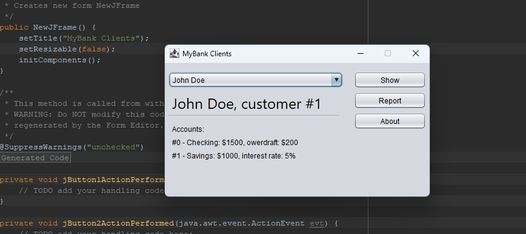

# UI Lab 4
## MatisseDemo
### Завдання 
<b>Завантажте jar-файл з усіма потрібними классами (Bank, Customer, Account та ін.) з наших попередніх лаб - MyBank
Створіть в Netbeans новий проект з назвою MatisseDemo (або використайте проект, створений в ході виконання попередньої роботи). УВАГА! Чекбокс Create Main Class треба очистити (не створювати виконуваний клас)!
Додайте до проекту завантажену вами бібліотеку - правою кнопкой на проекті, обрати Properties, потім у дереві категорій обрати Libraries (другий пункт зверху), натиснути у правій частині вікна кнопку Add JAR/Folder, обрати jar-файл, завантажений у п. 1, натиснути Ok
Додайте до проекту нову форму JFrame. З допомогою Matisse створіть інтерфейс, прототип якого ви бачили на початку цього завдання. УВАГА! Форма має або масштабуватись у зручний спосіб, або зміну її розмірів слід заборонити (властивість Resizeable)!</b>

### Результат

